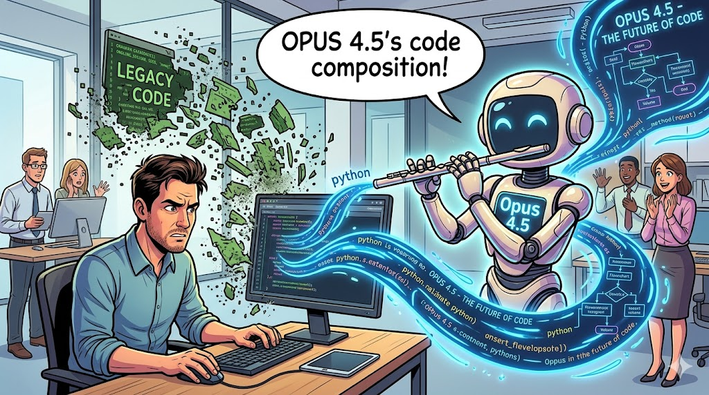
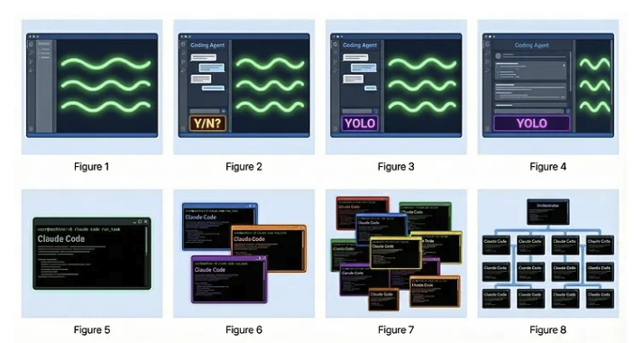
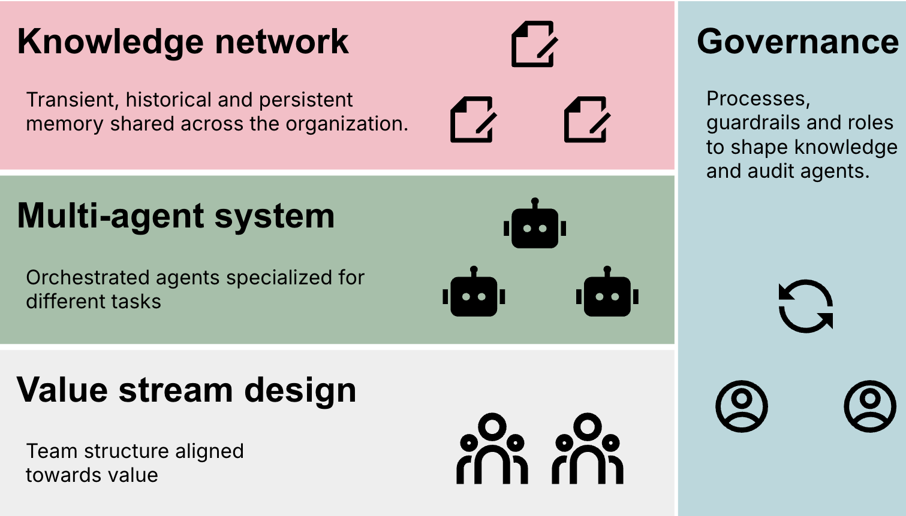
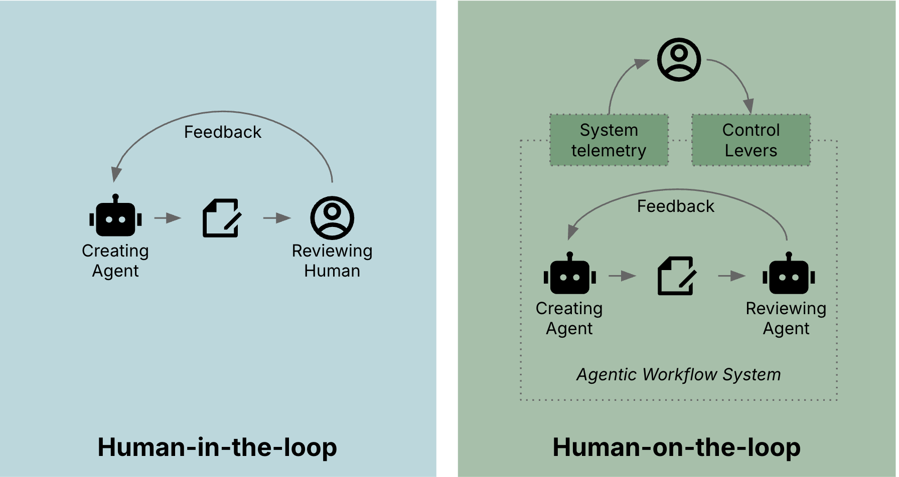
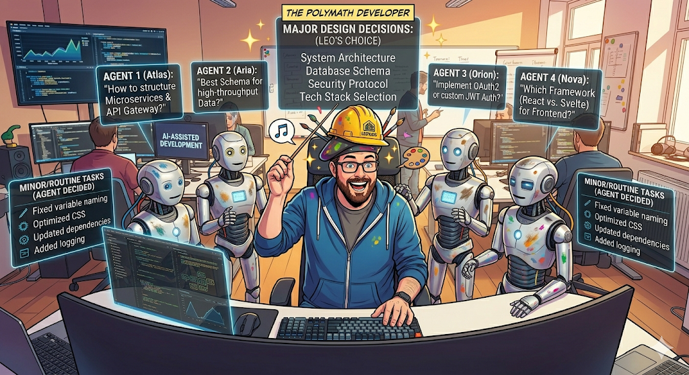
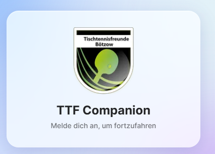

<!-- _class: lead -->

# Block 1: Grundlagen & Orientierung

**Workshop: Agentic Engineering**
Thomas Hein — Dataciders

<!--
Dauer: ~45 Minuten
Ziel: Grundverstaendnis schaffen, Orientierung geben, Motivation aufbauen
-->

---

# Meine Motivation

**24.11.2025** - Der Tag an dem Coding starb



[Opus 4.5 steht der Welt zur Verfügung](https://www.anthropic.com/news/claude-opus-4-5)

---

# Blick in die Zukunft — Was bleibt fuer uns übrig?

- Wer von euch findet gut, was gerade in der Softwareentwicklung passiert?
- Was sind Chancen und Risiken

<!--
Icebreaker: Handzeichen. Erzeugt sofort eine Diskussion.
Erwartung: gemischte Reaktionen — genau das ist der Punkt.
-->

---

# Die grosse Debatte

> "Nobody has to program. The programming language is human."
> — Jensen Huang, 2024

> "This is the best time yet to learn to code."
> — Bill Gates, 2025

> "You are orchestrating agents who do and acting as oversight."
> — Andrej Karpathy, 2026

**Es gibt sehr unterschiedliche Meinungen in der Community**

<!--
Drei Perspektiven: Ersetzung, Empowerment, Evolution.
Karpathy gibt die Antwort: Die Rolle aendert sich, verschwindet aber nicht.
Quellen: referenzen/quellen.md
-->

---

# Zahlen und Fakten

| Unternehmen | AI-generierter Code | Quelle            |
| ----------- | ------------------: | ----------------- |
| Google      |                >30% | Pichai, Q1 2025   |
| Microsoft   |              20-30% | Nadella, Apr 2025 |
| Meta        |  Ziel: 50% bis 2026 | Zuckerberg, 2025  |

- **Gartner:** 90% der Enterprise-Entwickler nutzen AI bis 2028
- **Aber:** 2500% mehr Defekte durch unkontrollierte AI-Nutzung

**📌 Erkenntnis:** Es wird mehr Software geben und diese Software ist fehlerhafter

<!--
Die Zahlen zeigen: AI-Code ist Realitaet.
Die Gartner-Warnung ist der Schluessel: UNKONTROLLIERT ist das Problem.
Genau deshalb brauchen wir Methodik — das ist die Bruecke zum Rest des Workshops.
-->

---

# Was ist Agentic Engineering nicht

| #   | Ansatz                      | Input                             | Menschliche Rolle |
| --- | --------------------------- | --------------------------------- | ----------------- |
| 1   | **Vibe Coding**             | Kurze Phrasen, fachliche Wuensche | Fachanwender      |
| 2   | **Spec-Driven (Business)**  | Pflichtenheft, Use Cases          | IT Consultant     |
| 3   | **Spec-Driven (Technical)** | UML, ERM, Architektur             | Architekt         |

<!--
Besonderheit: Die meisten Frameworks kategorisieren nach AI-Autonomie.
Unser Modell kategorisiert nach MENSCHLICHER ROLLE — greifbarer fuer Entwickler.
Begriffe: Vibe Coding (Karpathy 2025), Spec-Driven (Thoughtworks), Agentic Engineering (Karpathy 2026).
Business vs. Technical Spec ist unser eigener Beitrag.
-->

---

# Definition Agentic Engineering

> Agentic Engineering ist eine Softwareentwicklungsmethode, bei der Menschen KI-Agenten orchestrieren, um Code zu planen, zu schreiben, zu testen und bereitzustellen – unter strukturierter menschlicher Aufsicht.

- Steve Wilson


[Steve Yegge - Good Agile, Bad Agile](https://steve-yegge.blogspot.com/2006/09/good-agile-bad-agile_27.html)

---

# Änderungen im Arbeitsumfeld



- Teams nutzen Agenten
  - Teams können noch mehr Wertorientiert arbeiten
- Agenten benötigten Wissen um zu arbeiten
  - Wissen teilen und bereitstellen wird relevanter
- Es wird Aufgaben geben die Agententeams lösen können
  - Agententeams müssen aufgebaut und koordiniert werden

---

# Wird der Mensch abgelöst?

- Software ist für den Menschen gemacht!
- Dokumentation ist für den Menschen gemacht!
  
  **Nein, aber was wird seine Aufgabe in der Zukunft sein?**

---

# Ziele der Firma (meiner Ansicht nach)

**🏋️‍♂️ Commodity - Leistungsfähigkeit erreichen**

- Effizienzgewinne der AI nutzen mit gleichbleibender Qualität

**🏆 Bedienen neuer Aufgaben und Rollen im Enterprise Context**

- AI Agenten Virtuos nutzen um damit Prozesse zu gestalten
- AI Agenten Schwärme aufbauen und Orchestrieren können

---

# Mögliche Auswirkungen auf unser Berufsfeld

1. Softwareentwicklung wird **niederschwelliger**, es wird mehr Software geben
2. Es wird relevanter, Agenten zu **beherrschen** und das Wissen benötigte Wissen in den Kontext zu kriegen
3. Die Rolle verschiebt sich: **Code-Schreiber → Architekt, Steuermann, Qualitaetssicherer, UX Designer, Dev/Ops Engineer, AI Agent Engineer**
4. Oder ein Team besteht ausschließlich aus **UX Designer, AI Agent Engineer und PO**
5. AI Agenten können **100% des Codes erzeugen**, es liegt an uns, dass kein **schlechter** Code released wird.

Aber auch: **Human Coding bleibt relevant**

<!--
Punkt 4 ist die zentrale Botschaft des gesamten Workshops.
Ueberleitung: "Wie machen wir das konkret? Dafuer gibt es ein Modell."
-->

---

# Grundlegendes Credo

- Der Entwickler wird zum **Boss** des Agenten, nicht umgekehrt
- Man ist **verantwortlich** für das was man commiten lässt
- Verstärkung bestehender Fähigkeiten
  - Architektur
  - UX
  - Softwareentwicklungsprozessmethodik
  - Fullstackentwicklung
  - Betrieb von Software



---

# Auswirkungen auf Softwareentwicklungsprozess

## Chancen

- Mehr Konsistenz
- Mehr Qualität
- Mehr Fokus auf Werterzeugung
- Mehr Fokus auf Qualitätssicherung

## Neu zu erlernende Fähigkeiten

- Agenten zielgerichtet einsetzen und steuern können
- 20% → 100% Coding durch Agenten **(Ziel dieser Reihe)**
- Agentenschwärme bauen und monitoren

---

# Ziele und Inhalte der nächsten Einheiten

## Ziele

- Generische Vorgehensweisen zum Umgang mit Agenten lernen
- Coding mit bis zu 3 Agenten gleichzeitig
- Den eigenen Entwicklungsprozess verbessern

## Inhalte

- Verständnis von LLMs zum Agenten
- Veständnis über Kontextmanagement erlangen
- Agents.md, (Sub)Agenten und Skills für die eigene Zielstellung nutzbar machen
- Am Beispiel von Github Copilot CLI (IDE unabhängig)

---

# Was kann man schon heute tun

- Ausprobieren von skills, am besten die von obra

```
npx skills add https://github.com/obra/superpowers --skill using-superpowers
```

- brainstorming, plan, execution

  **Gerne am Beispielprojekt**
  

---

# Brainstorming & Planning mit dem Agenten

```
Anforderung → Brainstorming → Spec → Plan → Execution
```

1. **Brainstorming:** Anforderung verstehen, Optionen erkunden
2. **Spec:** Technische Spezifikation schreiben
3. **Plan:** Aufgaben in 5-20min Tasks zerlegen (TDD)
4. **Execution:** Task fuer Task umsetzen mit Entwickler-Checkpoints

<!--
Das ist der Kern des Agentic Engineering Workflows.
Demo: Eine Anforderung gemeinsam durchplanen.
Referenz: Addy Osmani "My LLM Coding Workflow 2026" / Martin Fowler "Humans and Agents"
-->

---

# Demo: Vibecoding vs Plan, Execute - Gleiche Aufgabe, zwei Ansaetze

**Aufgabe:** Zusammen mit der Gruppe bestimmmen

|                          | Vibe Coding       | Agentic Engineering        |
| ------------------------ | ----------------- | -------------------------- |
| **Input**                | "Bau mir X"       | Spec → Plan → TDD          |
| **Designentscheidungen** | Agent entscheidet | Entwickler entscheidet     |
| **Tests**                | Vielleicht        | Erst Test, dann Code       |
| **Nachvollziehbarkeit**  | Gering            | Hoch (Plan, Commits, Doku) |

<!--
Option A: Live-Demo (empfohlen, ~10min).
Option B: Aufgezeichnetes Video oder Chat-Mitschnitt.
Option C: Referenz-Video von GitHub Blog oder QCon.
Entscheidung: [Thomas waehlt vor dem Workshop]
-->

---

# Quellen & Weiterlesen — Blick in die Zukunft

- [thoughtworks Preparing your team for the agentic software development life cycle](https://www.thoughtworks.com/en-us/insights/articles/preparing-your-team-for-agentic-software-development-life-cycle)
- [Jensen Huang: "The programming language is human" (Tom's Hardware, 2024)](https://www.tomshardware.com/tech-industry/artificial-intelligence/jensen-huang-advises-against-learning-to-code-leave-it-up-to-ai) — NVIDIA CEO ueber AI und Programmierung
- [Bill Gates: "Best time to learn to code" (Windows Central, 2025)](https://www.windowscentral.com/artificial-intelligence/bill-gates-coding-will-remain-a-human-profession-centuries-later) — Gegenperspektive: AI als Werkzeug, nicht Ersatz
- [Andrej Karpathy: Agentic Engineering (X/Twitter, 2026)](https://x.com/karpathy/status/2019137879310836075) — Karpathys Vision: Orchestrierung statt direktes Coden
- [Gartner: 90% of enterprise developers will use AI by 2028 (April 2024)](https://www.gartner.com/en/newsroom/press-releases/2024-04-11-gartner-says-75-percent-of-enterprise-software-engineers-will-use-ai-code-assistants-by-2028) — Marktprognose mit Warnung vor unkontrollierter Nutzung

<!--
Link-Folie fuer Teilnehmer, die sich vertiefen wollen.
-->

---

# Quellen & Weiterlesen — Agentic Engineering

- [Andrej Karpathy: "Vibe Coding" (X/Twitter, Feb 2025)](https://x.com/karpathy/status/1886192184808149383) — Ursprung des Begriffs "Vibe Coding"
- [Andrej Karpathy: Software is Changing (X/Twitter, Feb 2026)](https://x.com/karpathy/status/2019137879310836075) — Karpathys Begriff "Agentic Engineering"
- [Thoughtworks: "Preparing your team for the agentic software development life cycle"](https://www.thoughtworks.com/en-us/insights/articles/preparing-your-team-for-agentic-software-development-life-cycle) — Spec-Driven Ansaetze im Vergleich
- [DEV Community: "The AI Coding Workflow That Actually Works: Separate Planning from Execution"](https://dev.to/matthewhou/separate-planning-from-execution-the-ai-coding-workflow-that-actually-works-1n00) — Praxis-Perspektive auf Agenten-Ansaetze

<!--
Link-Folie fuer Teilnehmer, die sich vertiefen wollen.
-->

---

# Quellen & Weiterlesen — Veraenderte Arbeitsweise

- [Andrej Karpathy: "You are orchestrating agents" (X/Twitter, 2026)](https://x.com/karpathy/status/2019137879310836075) — Die neue Rolle: Steuermann statt Tipper
- [Thoughtworks: Preparing your team for the agentic SDLC](https://www.thoughtworks.com/en-us/insights/articles/preparing-your-team-for-agentic-software-development-life-cycle) — Teamstruktur und Rollen im agentic Umfeld
- [GitHub Blog: Quantifying GitHub Copilot's impact on developer productivity](https://github.blog/news-insights/research/research-quantifying-github-copilots-impact-on-developer-productivity-and-happiness/) — Entwickler 55,8% schneller mit AI-Unterstuetzung
- [InfoQ: From Prompts to Production — a Playbook for Agentic Development](https://www.infoq.com/articles/prompts-to-production-playbook-for-agentic-development/) — Praxis-Playbook fuer Teams

<!--
Link-Folie fuer Teilnehmer, die sich vertiefen wollen.
-->

---

# Quellen & Weiterlesen — Demo und Ansaetze im Vergleich

- [Andrej Karpathy: Vibe Coding (X/Twitter, Feb 2025)](https://x.com/karpathy/status/1886192184808149383) — Ursprung des Begriffs: Coding im Flow ohne Code-Verstaendnis
- [The New Stack: Vibe Coding is Passé](https://thenewstack.io/vibe-coding-is-passe/) — Warum Vibe Coding an Grenzen stoesst und Agentic Engineering folgt
- [Dev.to: Separate Planning from Execution — The AI Coding Workflow That Actually Works](https://dev.to/matthewhou/separate-planning-from-execution-the-ai-coding-workflow-that-actually-works-1n00) — Praxis-Vergleich beider Ansaetze mit konkretem Workflow
- [GitHub Blog: Test-Driven Development with GitHub Copilot](https://github.blog/ai-and-ml/github-copilot/github-for-beginners-test-driven-development-tdd-with-github-copilot/) — TDD als Grundlage fuer nachvollziehbares Agentic Engineering
- [Glide Blog: What is Agentic Engineering](https://www.glideapps.com/blog/what-is-agentic-engineering) — Karpathys Definition und Abgrenzung zu Vibe Coding

<!--
Link-Folie fuer Teilnehmer, die sich vertiefen wollen.
-->
