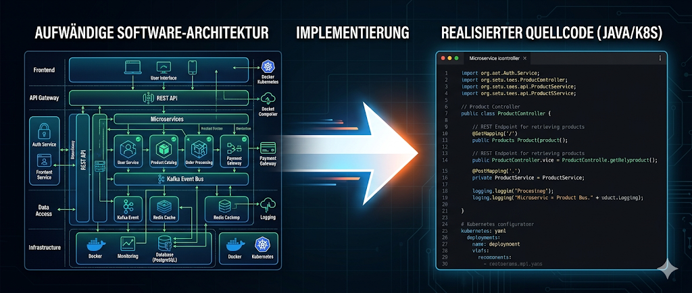
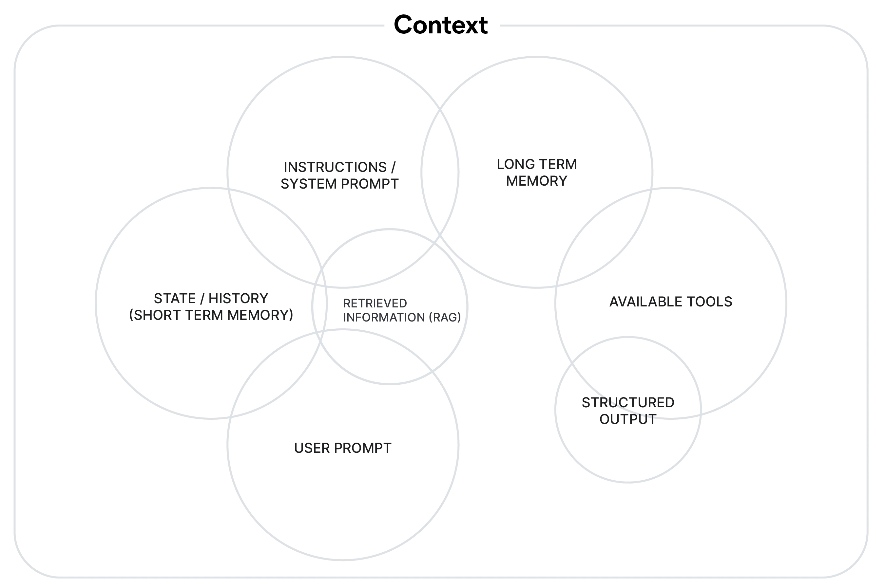

<!-- _class: lead -->


# Workshop: Agentic Engineering

**Workshop: Agentic Engineering**

**Methodische Anwendung von Agentic Engineering in der Praxis**


Thomas Hein — Dataciders

<!--
Dauer: ~50 Minuten
Ziel: Strukturierte Anforderungsanalyse und Planung mit dem Agenten
-->

---

# Zusammenfassung Block 1

- **Agentic Engineering** = Zielgenaue Entwicklung mit KI-Agente
- **Entwickler** -> trägt die volle Verantwortung der Lösung
- **Entwickler** -> ist der Boss des Agenten
  

- **Themen:** Umsetzen komplexer Anforderungen in maßgeschneiderte Lösung, Architektur, Einfluss auf agilen Prozess, Dokumentation, Frontend, Reviews, DevOps,




---

# Ganz Wichtig

**Der Entwickler muss immer eine Hand am Code haben.**
[] - Task 1 -> Agent
[] - Task 2 -> Agent
[] - Task 3 -> **Entwickler**
[] - Task 4 -> Agent
[] - Task 5 -> Entwickler 
[] - QS, Reviews, Manuelle Tests... -> Entwickler gerne mit Unterstützung

---

<!-- _class: lead -->

# Block 2: Von der Anforderung zum Plan

**Workshop: Agentic Engineering**
Thomas Hein — Dataciders

<!--
Dauer: ~50 Minuten
Ziel: Strukturierte Anforderungsanalyse und Planung mit dem Agenten
-->

---

# Das Ökosystem eines Coding Agents

<div class="columns">
<div>

## Kontextmanagement

- **Agents.md:** Allgemeine Regeln
- **Skills/Rules:** Vordefinierte Workflows, TDD-Skill

## Tools

- **MCP-Server:** Externe Datenquellen (DB, Jira, Git)
- **CLI:** Tools als CLI-Zugriffe
- **Hooks:** Automatische Aktionen bei Events
- **Plugins:** Erweiterungen (z.B. Context7)

</div>
<div>

## Governance

- **Settings:** Was darf ein Agent tun
- **Permissions:** Welche Tools sind erlaubt
- **Sandboxing:** Schutz vor unerwuenschten Aktionen

## Human

🤦‍♂️

</div>
</div>

<!--
MCP = Model Context Protocol (Anthropic, jetzt offener Standard).
Wird in Block 3 vertieft — hier nur Ueberblick.
-->

---

# Context Engineering — Was ist das?

- "The discipline of intelligently selecting, organizing, and delivering exactly what the AI needs to make good decisions — without overwhelming it. — Elastic"

**Was ist der Kontext?** Alles was das Modell in diesem Moment "sieht":

| Was                  | Beispiel                                       |
| -------------------- | ---------------------------------------------- |
| System-Prompt        | AGENTS.md, Regeln, Rolle                       |
| Conversation History | Alle bisherigen Nachrichten der Session        |
| Tool Results         | Dateiinhalte, Terminalausgaben, Testergebnisse |
| Injiziertes Wissen   | RAG-Ergebnisse, Dokumentation, Memory          |

[Context in Action](https://code.claude.com/docs/en/context-window)

---

# Context Engineering — Was ist das?



---

# Warum brauchen wir das? LLMs haben 4 Grundprobleme:

- Wissen eingefroren zum Trainingszeitpunkt → kein aktuelles Wissen
- Kein Zugriff auf private Unternehmensdaten
- Tendenz zu Halluzinationen bei fehlendem Kontext
- Kein persistentes Gedächtnis über Sessions hinweg

**Der Kontext-Window ist das wichtigste Betriebsmittel des Agenten**

- Enthält Code, Reasoning, Useranweisungen, generierten Code
- 200K Tokens sind 20K Zeilen Code.
- Opus 4.6 kann 100K Zeilen Code lesen

<!--
Quelle: elastic.co/what-is/context-engineering
Paradigmenwechsel: Nicht "Prompt Engineering" (taktisch) sondern "Context Engineering" (strategisch).
Praxisbeispiel: Contact Software — 20 Jahre alte Python-Plattform die LLMs nicht kennen.
-->

---

# Context Engineering — Die 4 Strategien

| Strategie       | Was                        | Beispiel                                 |
| --------------- | -------------------------- | ---------------------------------------- |
| **Selection**   | Nur notwendige Infos laden | RAG, AGENTS.md statt ganzer Codebasis    |
| **Writing**     | Zustand extern speichern   | Memory-Dateien, Scratchpads, ADRs        |
| **Compression** | Token reduzieren           | `/compact`, Zusammenfassungen, Trimming  |
| **Isolation**   | Aufgaben aufteilen         | Subagenten mit eigenem, sauberem Kontext |

- Kurze Demo in Copilot CLI (/usage, /compact, /rewind)

> Mehr Information ≠ bessere Entscheidungen — Relevanz schlägt Vollständigkeit

<!--
Quelle: elastic.co/what-is/context-engineering
Die 4 Strategien sind das Handwerkszeug des Context Engineers.
Isolation = Subagenten — Bruecke zu Block 3.
-->

---

# Context Rot — Wenn der Kontext kippt

**Context Rot** = schleichende Qualitätsdegradation durch zu vollen Kontext

- **"Lost in the middle"** — Informationen in der Mitte langer Kontexte werden schlechter erinnert
- **Noise-Effekt** — Irrelevante Inhalte lenken das Modell ab, Fehlerrate steigt
- **Fehler-Akkumulation** — Falsche Antworten werden Teil des nächsten Kontexts

**Symptome:**

- Agent wiederholt Fehler trotz Korrektur
- Agent "vergisst" frühere Instruktionen
- Qualität nimmt im Laufe der Session ab

**Gegenmassnahmen:** `/clear` — `/compact` — Subagenten — kurze Sessions

<!--
Context Rot ist der Hauptgrund fuer Qualitaetsverlust in langen Agenten-Sessions.
Demo-Tipp: Zeigen wie `/clear` eine Session "resettet".
Referenz: elastic.co + Claude Code Best Practices
-->

---

## Relevante Formate für Agenten

| Inhale                | Wofuer                | Agent-Verstaendnis |
| --------------------- | --------------------- | ------------------ |
| **Agents.md**         | Alles                 | ★★★ Exzellent      |
| **UML** (Mermaid)     | Architektur, Ablaeufe | ★★☆ Gut            |
| **ADRs**              | Designentscheidungen  | ★★★ Exzellent      |
| **Code-Beispiele**    | Konventionen zeigen   | ★★★ Exzellent      |
| **Coding Guidelines** | Standards durchsetzen | ★★★ Exzellent      |

---

# Agents.md — Die wichtigste Datei fuer den Kontext

<!--
Uebergangsfolie — kurze Pause, dann in die Tiefe gehen.
-->


---

# Was ist Agents.md?

**Das "Betriebshandbuch" fuer deinen Coding-Agenten**

- **Zweck:** Regeln, Kontext und Grenzen fuer den Agenten
- **Wo:** Repo-Root — wird automatisch geladen
- **Varianten:** `AGENTS.md` · `CLAUDE.md` · `GEMINI.md` · `copilot-instructions.md`
- **Analogie:** README fuer Menschen — AGENTS.md fuer Agenten

**Ohne Agents.md:** Der Agent rät — mit Agents.md: Der Agent weiß.

> "Most agent files fail because they're too vague." — Matt Nigh, GitHub (2500+ Repos Studie)

<!--
Quelle: GitHub Blog — "How to write a great agents.md" (Matt Nigh, Nov 2025)
Analyse von 2500+ öffentlichen Repos.
Key Insight: "You are a helpful coding assistant" funktioniert nicht.
"You are a test engineer who writes tests for React components" schon.
-->

---

# Die 6 Kernbereiche eines guten Agents.md

Aus der Analyse von **2.500+ Repositories** (GitHub Blog, Matt Nigh):

1. **Commands** — Exakte Build-, Test-, Lint-Kommandos mit Flags
2. **Testing** — Framework, Strategie, was getestet wird
3. **Projektstruktur** — Verzeichnisse, Tech-Stack mit Versionen
4. **Code Style** — Echte Code-Beispiele statt Prosa
5. **Git Workflow** — Branch-Strategie, Commit-Format, PR-Regeln
6. **Grenzen** — Always  | Ask first  | Never 

> Wer diese 6 Bereiche abdeckt, ist in den **Top-Repos** laut der Studie.

<!--
Quelle: GitHub Blog — "How to write a great agents.md" (Matt Nigh, Nov 2025)
"Hitting these areas puts you in the top tier."
Wichtig: Code-Beispiele > Erklaerungen. Ein Snippet zeigt dem Agenten mehr als drei Absaetze.
-->

---

# Best Practices & Anti-Patterns

<div class="columns">
<div>

## ✅ Das funktioniert

- **Kommandos frueh:** `npm test`, `pytest -v` mit Flags
- **Code-Beispiele:** Ein Snippet > drei Absaetze
- **Stack spezifisch:** "React 18 + TypeScript + Vite"
- **Klare Grenzen:** Always / Ask first / Never
- **Iterativ wachsen:** Klein starten, bei Fehlern ergaenzen

</div>
<div>

## ❌ Das funktioniert nicht

- **Vage Persona:** "Du bist ein hilfreicher Assistent"
- **Nur Prosa:** Keine ausfuehrbaren Kommandos
- **Alles auf einmal:** Gesamte Doku in eine Datei
- **Keine Beispiele:** Regeln ohne Code-Demos
- **Keine Grenzen:** Agent darf "alles" → macht Fehler

</div>
</div>

<!--
Quelle: GitHub Blog — "How to write a great agents.md" (Matt Nigh, Nov 2025)
Anti-Pattern "helpful assistant" war der haeufigste Fehler in der Studie.
Best Practice "Never commit secrets" war die haeufigste hilfreiche Constraint.
-->

---

# Progressive Disclosure — Nur laden was noetig ist

**Prinzip:** Nicht alles in die Agents.md — sondern verlinken und bei Bedarf laden.

```
AGENTS.md (immer geladen — kompakt halten!)
  ├── docs/commands.md        → "Lies wenn du Tests ausfuehrst"
  ├── docs/conventions.md     → "Lies wenn du Code schreibst"
  ├── docs/api-endpoints.md   → "Lies wenn du an der API arbeitest"
  └── data-model.mmd          → "Lies VOR jeder DB-Aenderung"
```

**Beispiel aus dem Demo-Projekt (CLAUDE.md):**

- Features → `docs/claude/features.md` — bei Funktionalitaets-Fragen
- Tech Stack → `docs/claude/tech-stack.md` — bei Framework-Fragen
- Datenmodell → `data-model.mmd` — **immer** vor DB-Aenderungen

> **Warum?** Weniger Tokens = bessere Entscheidungen (Context Rot vermeiden!)

<!--
Progressive Disclosure ist ein UX-Prinzip: Zeige nur was gerade relevant ist.
Das Demo-Projekt (table-tennis-planner) nutzt genau dieses Muster.
Verbindung zu Context Engineering: Selection-Strategie in der Praxis.
-->

---

# Uebung: Agents.md gemeinsam mit dem Agenten erstellen

**Ziel:** AGENTS.md fuer `src/demo-project/table-tennis-planner/` erstellen

1. **Systemprompt** aktivieren (z.B. `using-superpowers` Skill)
2. **Vorlage** oeffnen: `best-practices-ai/agents-md/vorlage-agents-md.md`
3. **Agent fuehrt:** Projekt erkunden lassen, Fragen beantworten
4. **Gemeinsam** die 6 Kernbereiche ausfuellen
5. **Review:** Ergebnis kritisch pruefen

<!--
Dauer: ~15 Minuten
Workflow: Systemprompt (using-superpowers o.ae.) → Vorlage als Kontext geben → Agent exploriert Projekt → Gemeinsam ausfuellen.
-->

---

# Uebung: Materialien & Tipps

**Beispiel-Prompt:**

```
Ich moechte ein AGENTS.md fuer dieses Projekt erstellen.
Nutze die Vorlage in best-practices-ai/agents-md/vorlage-agents-md.md
als Basis. Erkunde das Projekt, stelle mir Fragen
und fuelle die 6 Kernbereiche gemeinsam mit mir aus.
```

- **Vorlage:** `best-practices-ai/agents-md/vorlage-agents-md.md`
- **Referenz:** [AGENTS.md aus Praxis-Projekt](https://dataciders.ghe.com/Thomas-Hein/contact-ai-best-practices/blob/main/AGENTS.md)
- **Tech-Stack:** Next.js, Prisma, Tailwind, Vitest, Playwright
- **Kernfrage:** Was soll der Agent **nie** tun?

> Der Agent kennt euer Projekt nicht — fuettert ihn mit der Vorlage und lasst ihn Fragen stellen!

<!--
Referenz-AGENTS.md aus dem contact-ai-best-practices Repo zeigt ein reales Beispiel mit Progressive Disclosure, Workflows pro Task-Typ, und Build-Kommandos.
-->

---

# Skills: Die Methodik ins Projekt bringen

<!--
Uebergangsfolie — von Agents.md (statischer Kontext) zu Skills (dynamische Workflows).
-->

---

# Was sind Skills?

**Skills = wiederverwendbare Workflow-Anleitungen fuer Agenten**

- **Prompt:** Einmalige Anweisung ("Schreib einen Test")
- **Rule:** Immer aktive Regel ("Nutze TypeScript strict mode")
- **Skill:** Kompletter Workflow mit Schritten, Checklisten, Entscheidungsbaum

```markdown
# TDD-Skill (Auszug)
1. Test schreiben → ROT sehen
2. Minimalen Code schreiben → GRUEN sehen
3. Refactoring → Tests erneut GRUEN
4. Commit
```

> Skills sind **Prozess-Wissen** — sie sagen dem Agenten nicht WAS, sondern WIE.

<!--
Skills sind das fehlende Stueck zwischen Agents.md (Kontext) und dem Agent-Loop (Execution).
Agents.md sagt "Wir nutzen TDD" — der Skill sagt "So geht TDD Schritt fuer Schritt".
-->

---

# Welche Methodik will man im Projekt haben?

Was wünscht ihr euch?

---

# Welche Methodik will man im Projekt haben?

- **TDD** — Red-Green-Refactor Zyklus erzwingen
- **Code Reviews** — Automatisches Pre-Review vor jedem Merge
- **Planung** — Specs und Plans vor Code schreiben
- **Debugging** — Systematisch statt Raten (4-Phasen-Prozess)
- **Execution** — Task-fuer-Task mit Entwickler-Checkpoints
- **Git Workflow** — Worktrees, Branches, Commits
- **Verifikation** — Beweise vor Behauptungen ("Es funktioniert" → zeig mir)

> Ohne Skills raet der Agent bei der Methodik — mit Skills haelt er sich daran.

<!--
Das sind die typischen Bereiche, die man als Skills abbilden kann.
Nicht alle braucht man sofort — iterativ aufbauen, wie bei Agents.md.
-->

---


# Brainstorming & Planning mit dem Agenten

```
Anforderung → Brainstorming → Spec → Plan → Execution
```

1. **Brainstorming:** Anforderung verstehen, Optionen erkunden
2. **Spec:** Technische Spezifikation schreiben
3. **Plan:** Aufgaben in 5-20min Tasks zerlegen (TDD)
4. **Execution:** Task fuer Task umsetzen mit Entwickler-Checkpoints
> Das ist trotzdem nicht 100% optimal - lass uns herausfinden warum
---

# Übung
**Ziel:** Anforderung gemeinsam mit dem Agenten durchplanen
3 Arten der Planung
- Superpowers "writing-plans" Skill
- Freestyle Prompting
- writing-plan von Microsof
  
**Anforderung:** "Füge einen Vereinsplan hinzu, damit man sämtliche Spiele aller Manschaften sehen kann."

<!--
Das ist der Kern des Agentic Engineering Workflows.
Demo: Eine Anforderung gemeinsam durchplanen.
Referenz: Addy Osmani "My LLM Coding Workflow 2026" / Martin Fowler "Humans and Agents"
-->

---

# Wann volle Methodik, wann reduziert?

| Aufgabe                | Methodik                          |
| ---------------------- | --------------------------------- |
| Neues Modul / Feature  | Brainstorming → Spec → Plan → TDD |
| Groesseres Refactoring | Plan → TDD                        |
| API-Aenderung          | Spec → Plan → TDD                 |
| Kleine UI-Aenderung    | Direkter Prompt mit Test          |
| Bugfix (lokal)         | Failing Test → Fix                |
| Config-Aenderung       | Direkter Prompt                   |

<!--
Nicht jede Aufgabe braucht den vollen Workflow.
Die Kunst ist, die richtige Stufe zu waehlen.
Faustregel: Wenn mehr als 2 Dateien betroffen → mindestens Plan.
-->

---

# Community-Skills: Superpowers (170k+ Stars)

**superpowers** — komplette Entwicklungsmethodik als Skill-Sammlung

- **Brainstorming** — Ideen durch Fragen verfeinern, Design validieren
- **Writing Plans** — Aufgaben in 2-5 Min Tasks zerlegen (TDD, YAGNI, DRY)
- **TDD** — Red-Green-Refactor erzwingen, Tests nie anpassen
- **Systematic Debugging** — 4-Phasen Root-Cause-Analyse
- **Code Review** — Pre-Review Checkliste, Severity-basiert
- **Verification** — Beweise vor Erfolgs-Behauptungen
- **Subagent Development** — Parallele Ausfuehrung mit Review
- **Git Worktrees** — Isolierte Branches fuer Features

Installation: `/plugin install superpowers` (Claude Code)

<!--
Superpowers von Jesse Vincent (obra) — 170k+ Stars auf GitHub.
Funktioniert mit Claude Code, Copilot CLI, Cursor, Codex, Gemini CLI, OpenCode.
Philosophie: Test-Driven, Systematic over ad-hoc, Evidence over claims.
Quelle: https://github.com/obra/superpowers
-->

---

# Ausblick: Subagenten & Multi-Agent

- **Subagenten:** Spezialisierte Agenten fuer Teilaufgaben
  - Recherche-Agent, Test-Agent, Review-Agent
- **Koordination:** Hauptagent delegiert und integriert
- **Praxis heute:** Claude Code Subagents, GitHub Copilot Agent Mode

> Noch frueh — aber die Richtung ist klar.

<!--
Nicht Workshop-Fokus, aber wichtig zu erwaehnen.
-->

---

# Quellen & Weiterlesen — Kontextmanagement

- [Martin Fowler — Context Engineering for Coding Agents](https://martinfowler.com/articles/exploring-gen-ai/context-engineering-coding-agents.html) — Grundlagen und Patterns fuer kontextbewusstes Agenten-Design
- [Anthropic — Effective context engineering for AI agents](https://www.anthropic.com/engineering/effective-context-engineering-for-ai-agents) — Empfehlungen direkt vom Hersteller
- [GitHub Blog — How to write a great agents.md](https://github.blog/ai-and-ml/github-copilot/how-to-write-a-great-agents-md-lessons-from-over-2500-repositories/) — Lessons from over 2,500 repositories
- [AGENTS.md Specification — ASDLC](https://asdlc.io/practices/agents-md-spec/) — Offizielle Spec und Best Practices
- [JetBrains Research — Smarter Context Management for LLM-Powered Agents](https://blog.jetbrains.com/research/2025/12/efficient-context-management/) — Effizientes Kontext-Management in der Praxis

<!--
Link-Folie fuer Teilnehmer, die sich vertiefen wollen.
-->

---

# Quellen & Weiterlesen — Funktionsweise Coding Agent

- [DEV Community: "Forget the Hype: Agents are Loops"](https://dev.to/jakesweb/forget-the-hype-agents-are-loops-2fi5) — Praxis-Erklaerung des Agent-Loop-Konzepts
- [Oracle: "What Is the AI Agent Loop?"](https://www.oracle.com/artificial-intelligence/what-is-ai-agent-loop/) — Perceive/Reason/Plan/Act/Observe Schleife
- [Model Context Protocol — Architektur](https://modelcontextprotocol.io/docs/concepts/architecture) — MCP Host-Client-Server Konzept
- [GitHub Blog: Copilot Ask, Edit, Agent modes](https://github.blog/ai-and-ml/github-copilot/github-copilot-agent-mode-is-now-generally-available/) — Drei Modi im Vergleich

<!--
Link-Folie fuer Teilnehmer, die sich vertiefen wollen.
-->

---

# Quellen & Weiterlesen — Dokumentation als Steuerungsinstrument

- [Mintlify — What to Include in AGENTS.md](https://www.mintlify.com/agentsmd/agents.md/guides/what-to-include) — Welche Doku-Inhalte Agenten wirklich brauchen
- [AI Hero — A Complete Guide To AGENTS.md](https://www.aihero.dev/a-complete-guide-to-agents-md) — Praxisleitfaden fuer agentengerechte Dokumentation
- [Harness — The Agent-Native Repo: Why AGENTS.MD is the New Standard](https://www.harness.io/blog/the-agent-native-repo-why-agents-md-is-the-new-standard) — ADRs, Guidelines und Doku-Schichten im Ueberblick
- [GitHub Blog — How to write a great agents.md](https://github.blog/ai-and-ml/github-copilot/how-to-write-a-great-agents-md-lessons-from-over-2500-repositories/) — Lessons from over 2,500 repositories
- [Elastic — What is Context Engineering? Architecting Reliable AI](https://www.elastic.co/what-is/context-engineering) — Doku als Kontext-Fundament fuer zuverlaessige Agenten

<!--
Link-Folie fuer Teilnehmer, die sich vertiefen wollen.
-->

---

# Quellen & Weiterlesen — Brainstorming und Planning

- [Claude Code: Best Practices](https://code.claude.com/docs/en/best-practices) — Offizielle Empfehlungen von Anthropic: Workflow, Planning und Execution mit Claude Code
- [Dev.to — The AI Coding Workflow That Actually Works: Separate Planning from Execution](https://dev.to/matthewhou/separate-planning-from-execution-the-ai-coding-workflow-that-actually-works-1n00) — Warum Planung und Umsetzung getrennt werden sollten
- [superpowers — writing-plans Skill (SKILL.md)](https://github.com/obra/superpowers/blob/main/skills/writing-plans/SKILL.md) — Praxisvorlage fuer strukturierte Planung mit dem Agenten
- [InfoQ — From Prompts to Production: a Playbook for Agentic Development](https://www.infoq.com/articles/prompts-to-production-playbook-for-agentic-development/) — Vollstaendiges Playbook vom Prompt bis zum Deployment
- [Thoughtworks — Preparing your team for the agentic software development life cycle](https://www.thoughtworks.com/en-us/insights/articles/preparing-your-team-for-agentic-software-development-life-cycle) — Team-Vorbereitung auf den Agentic SDLC

<!--
Link-Folie fuer Teilnehmer, die sich vertiefen wollen.
-->

---
