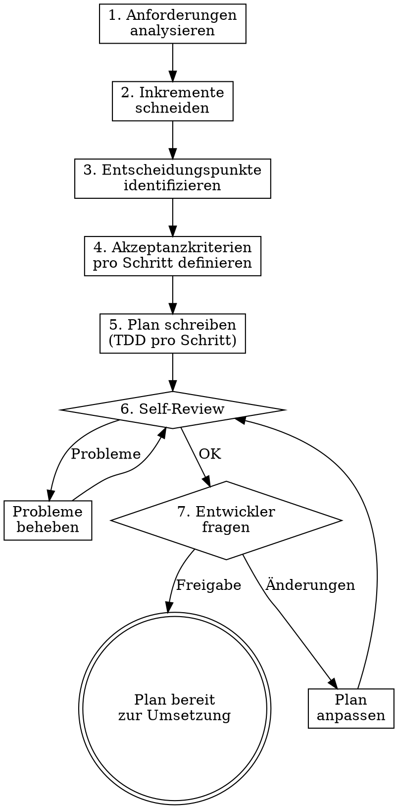

# Datacider Planning

## Overview

Create incremental, test-driven implementation plans where every step produces a verifiable result. The developer stays in control through explicit decision points, and acceptance criteria are auto-testable by the agent.

**Core principle:** Plan so that the developer can verify every step — through failing/passing tests, API calls, Storybook, or the UI. The agent prepares verification tooling as part of each step.

**Announce at start:** "Ich verwende datacider-planning um einen testgetriebenen, inkrementellen Plan zu erstellen."

## When to Use

- New features requiring multiple files/components
- Changes spanning backend + frontend
- Any task benefiting from incremental, verifiable delivery

## When NOT to Use

- Quick one-file fixes
- Pure config changes
- Tasks the developer explicitly wants to do ad-hoc

## The Planning Process



## Step 1: Anforderungen analysieren

Before planning, understand:
- Read the data model (`data-model.mmd`)
- Read CLAUDE.md for conventions
- Identify which layers are affected (DB, API, Hooks, Components, Pages)
- List all acceptance criteria from the user's request

**Ask the developer:**
> "Ich habe folgende Anforderungen verstanden: [Liste]. Fehlt etwas? Gibt es Prioritäten?"

## Step 2: Inkremente schneiden

Break the feature into increments. Each increment MUST:
- Produce a **verifiable result** the developer can check
- Be **independently testable** (not dependent on later increments to verify)
- Follow this order: **Schema → API → Hook → Component → Page Integration**

### Verifiability Matrix

| Layer | How to Verify | Agent Prepares |
|-------|--------------|----------------|
| **DB Schema** | Prisma migrate/push succeeds | Migration command |
| **API Route** | curl/fetch call returns expected response | Exact curl command with test data |
| **Custom Hook** | Unit test passes | Vitest test file |
| **Component** | Storybook story renders correctly | Storybook story file |
| **Page Integration** | UI shows correct behavior | Playwright test or manual check description |
| **Business Logic** | Unit test passes | Vitest test file |

## Step 3: Entscheidungspunkte identifizieren

Mark where the developer MUST be asked before proceeding. These are:

- **Architecture decisions**: "Soll X als eigene Komponente oder in Y integriert werden?"
- **Data model changes**: "Ich würde das Schema so erweitern: [Schema]. Einverstanden?"
- **UX choices**: "Für die Darstellung sehe ich zwei Optionen: [A] oder [B]. Was bevorzugst du?"
- **API design**: "Der Endpunkt könnte [Option A] oder [Option B] sein. Was passt besser?"
- **Trade-offs**: "Einfacher mit X, flexibler mit Y. Was ist hier wichtiger?"

**Rule:** When in doubt, ask. A 30-second question saves hours of rework.

## Step 4: Akzeptanzkriterien pro Schritt

Every step gets acceptance criteria in one of these forms:

### Auto-testbar (Agent prüft selbst)

```markdown
**Akzeptanzkriterien:**
- [ ] `npx vitest run path/to/test.ts` → PASS
- [ ] `curl -X GET http://localhost:3000/api/endpoint` → `{ "expected": "response" }`
- [ ] `npx prisma db push` → keine Fehler
```

### Entwickler-testbar (Agent bereitet vor, Entwickler prüft)

```markdown
**Akzeptanzkriterien:**
- [ ] Storybook-Story unter `components/MyComponent.stories.tsx` zeigt korrektes Rendering
- [ ] Auf `/trainer` ist der neue Tab sichtbar und klickbar
- [ ] Nach Login als Trainer erscheint [erwartetes Verhalten]

**Zum Prüfen:** `npm run storybook` → http://localhost:6006 → [Story-Pfad]
```

## Step 5: Plan schreiben

### Plan-Header

```markdown
# [Feature Name] — Datacider Plan

**Ziel:** [Ein Satz]

**Inkremente:** [Anzahl] Schritte, jeder einzeln verifizierbar

**Entscheidungspunkte:** [Anzahl] Stellen, an denen der Entwickler gefragt wird

**Tech:** [Relevante Technologien]

---
```

### Schritt-Struktur

````markdown
## Schritt N: [Was dieses Inkrement liefert]

**Ergebnis:** [Was der Entwickler danach sehen/testen kann]

**Dateien:**
- Erstellen: `exact/path/to/file.ts`
- Ändern: `exact/path/to/existing.ts`
- Test: `exact/path/to/test.ts`

### N.1 Failing Test schreiben

```typescript
// exact/path/to/test.ts
import { describe, it, expect } from 'vitest';

describe('specificBehavior', () => {
  it('should do expected thing', () => {
    const result = myFunction(input);
    expect(result).toEqual(expected);
  });
});
```

### N.2 Test ausführen — FAIL erwarten

```bash
npx vitest run path/to/test.ts
```
Erwartet: FAIL — `myFunction is not defined`

### N.3 Minimal implementieren

```typescript
// exact/path/to/file.ts
export function myFunction(input: InputType): OutputType {
  return expected;
}
```

### N.4 Test ausführen — PASS erwarten

```bash
npx vitest run path/to/test.ts
```
Erwartet: PASS

### N.5 Commit

```bash
git add path/to/test.ts path/to/file.ts
git commit -m "feat: add specific feature"
```

**Akzeptanzkriterien:**
- [ ] `npx vitest run path/to/test.ts` → PASS
- [ ] [Weitere Kriterien je nach Layer]

---

> **🔧 ENTSCHEIDUNGSPUNKT** (falls vorhanden)
> [Frage an den Entwickler]
> Optionen:
> - **A:** [Beschreibung + Vor-/Nachteile]
> - **B:** [Beschreibung + Vor-/Nachteile]
> → Antwort abwarten, bevor nächster Schritt beginnt.
````

### Storybook-Schritte (für Komponenten)

````markdown
### N.6 Storybook-Story erstellen

```typescript
// exact/path/to/Component.stories.tsx
import type { Meta, StoryObj } from '@storybook/react';
import { Component } from './Component';

const meta: Meta<typeof Component> = {
  title: 'Category/Component',
  component: Component,
};
export default meta;

type Story = StoryObj<typeof Component>;

export const Default: Story = {
  args: { /* props */ },
};
```

**Akzeptanzkriterien:**
- [ ] `npm run storybook` → Story rendert korrekt unter Category/Component
````

### API-Verifikations-Schritte

````markdown
### N.7 API-Endpunkt verifizieren

```bash
# Dev-Server muss laufen: npm run dev
curl -X POST http://localhost:3000/api/endpoint \
  -H "Content-Type: application/json" \
  -H "Cookie: tt-session=<session-cookie>" \
  -d '{"key": "value"}'
```

Erwartete Antwort:
```json
{ "success": true, "data": { ... } }
```

**Akzeptanzkriterien:**
- [ ] HTTP 200 mit erwartetem Response-Body
- [ ] Daten in DB korrekt gespeichert (prüfen via Prisma Studio oder nächster GET-Request)
````

## Step 6: Self-Review

After writing the complete plan, review against this checklist:

| Prüfpunkt | Frage |
|-----------|-------|
| **Vollständigkeit** | Deckt der Plan alle Anforderungen ab? |
| **Inkrementell** | Liefert JEDER Schritt ein verifizierbares Ergebnis? |
| **TDD** | Hat JEDER Implementierungsschritt erst einen Test? |
| **Akzeptanzkriterien** | Hat JEDER Schritt konkrete, ausführbare Kriterien? |
| **Entscheidungspunkte** | Sind ALLE Architektur-/UX-/API-Entscheidungen markiert? |
| **Keine Platzhalter** | Kein "TBD", "TODO", "ähnlich wie Schritt X"? |
| **Reihenfolge** | Schema → API → Hook → Component → Page? |
| **Typen-Konsistenz** | Stimmen Typen/Funktionsnamen über alle Schritte? |
| **Konventionen** | Folgt der Plan den CLAUDE.md-Konventionen? |

Fix issues found. Then proceed to user approval.

## Step 7: Entwickler-Freigabe

Present the plan to the developer with:

```
Plan ist fertig. Zusammenfassung:

- **[N] Schritte**, jeder einzeln verifizierbar
- **[M] Entscheidungspunkte**, an denen ich dich frage
- **Geschätzter Umfang:** [Einschätzung der Komplexität]

Übersicht der Schritte:
1. [Schritt 1 — Ergebnis]
2. [Schritt 2 — Ergebnis]
...

Entscheidungspunkte:
- Schritt N: [Frage]
- Schritt M: [Frage]

Soll ich den vollständigen Plan zeigen, oder können wir direkt starten?
```

**Wait for explicit approval before execution.**

## Execution Rules

During plan execution:

1. **Stop at every decision point** — present options, wait for answer
2. **Run all acceptance criteria** after each step — report results
3. **If a criterion fails:** Stop, diagnose, ask developer if unclear
4. **After each step:** Brief status update ("Schritt N fertig. Alle Kriterien erfüllt. Weiter mit Schritt N+1?")
5. **Developer can always say:** "Zeig mir erstmal das Ergebnis" — then show/demo before continuing

## No Placeholders

Same as writing-plans: every step contains actual code, actual commands, actual expected output. Never write:
- "TBD", "TODO", "später ergänzen"
- "Ähnlich wie Schritt X" (wiederhole den Code)
- "Passende Fehlerbehandlung ergänzen"
- Steps without code blocks for code changes

## Plan Location

Save plans to: `plan/YYYY-MM-DD-<feature-name>.md`
(Follows project convention from CLAUDE.md)

## Integration

**Works with:**
- **superpowers:subagent-driven-development** — For executing steps via subagents
- **superpowers:executing-plans** — For inline execution
- **superpowers:finishing-a-development-branch** — After all steps complete
- **superpowers:verification-before-completion** — Final verification

## Common Mistakes

| Fehler | Lösung |
|--------|--------|
| Alle Schritte auf einmal ohne Verifikation | STOP — jeder Schritt wird einzeln verifiziert |
| Entscheidung selbst getroffen | STOP — bei Entscheidungspunkten immer fragen |
| Test nach Implementation geschrieben | STOP — TDD: Test IMMER zuerst |
| Großer Schritt ohne testbares Ergebnis | Aufteilen in kleinere, verifizierbare Inkremente |
| Storybook/API-Check vergessen | Jede UI-Komponente braucht eine Story, jeder Endpunkt einen curl-Test |
