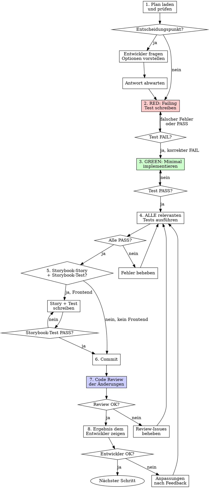

# Datacider Executing

## Overview

Execute a datacider-planning plan step by step. The developer stays in control: they decide at design/architecture points, verify results, and approve before moving on. Every step follows TDD. Every task gets a code review. All relevant tests run after each change.

**Core principle:** Der Entwickler entscheidet, der Agent implementiert und verifiziert.

**Announce at start:** "Ich verwende datacider-executing um den Plan Schritt für Schritt umzusetzen."

## When to Use

- A `datacider-planning` plan exists and is approved
- Step-by-step execution with developer oversight is desired

## Git Worktree — Isolierte Arbeit

**Vor dem Start** immer einen Git Worktree für den Feature-Branch anlegen:

```bash
# Worktree erstellen
git worktree add ../<project>-<feature-name> -b feature/<feature-name>

# .env und .env.local in den Worktree kopieren (sind gitignored)
cp .env ../<project>-<feature-name>/.env
cp .env.local ../<project>-<feature-name>/.env.local

# Dependencies installieren
cd ../<project>-<feature-name> && npm install
```

**Alle Arbeit findet im Worktree statt**, nicht im Hauptprojekt. Nach Abschluss:
- Branch mergen oder PR erstellen
- Worktree aufräumen: `git worktree remove ../<project>-<feature-name>`

## Test Commands

```bash
# All unit tests
npx vitest run

# Specific test file
npx vitest run path/to/test.ts

# Storybook tests (frontend component tests)
npx vitest --project=storybook

# Storybook visual check
npm run storybook

# Lint
npm run lint

# Build (nach letztem Schritt und bei finaler Verifikation)
npm run build
```

## The Execution Process



## Step-by-Step Protocol

### 1. Plan laden und prüfen

```
Plan lesen: plan/YYYY-MM-DD-<feature>.md
Aktuellen Schritt identifizieren (erster nicht abgehakter)
Akzeptanzkriterien des Schritts notieren
```

Ankündigung an Entwickler:
> "Starte mit Schritt N: [Beschreibung]. Ergebnis wird sein: [was verifizierbar ist]."

### 2. Entscheidungspunkte — Entwickler entscheidet

Bei jedem `🔧 ENTSCHEIDUNGSPUNKT` im Plan:

```
Ich bin bei Schritt N und es gibt eine Entscheidung:

[Frage aus dem Plan]

Option A: [Beschreibung]
  + [Vorteil]
  - [Nachteil]

Option B: [Beschreibung]
  + [Vorteil]
  - [Nachteil]

Meine Empfehlung: [Option X], weil [Grund].
Was möchtest du?
```

**Regel:** NIEMALS eine Entscheidung selbst treffen. Immer Optionen vorstellen und warten.

### 3. TDD — RED → GREEN

**RED: Failing Test zuerst**
```bash
# Test schreiben wie im Plan definiert
# Dann ausführen:
npx vitest run path/to/test.ts
# Erwartet: FAIL
```

Wenn Test sofort PASS → Test ist falsch. Korrigieren.

**GREEN: Minimal implementieren**
```bash
# Minimale Implementierung
# Dann prüfen:
npx vitest run path/to/test.ts
# Erwartet: PASS
```

### 4. Alle relevanten Tests ausführen

Nach jeder Implementierung:

```bash
# Unit-Tests für geänderte Bereiche
npx vitest run

# Bei Frontend-Änderungen zusätzlich:
npx vitest --project=storybook

# Lint
npm run lint
```

**Bericht an Entwickler:**
> "Tests: ✅ 42 passed, 0 failed. Lint: ✅ clean."

oder bei Problemen:
> "Tests: ❌ 2 failed. [Fehlerdetails]. Ich behebe das."

### 5. Frontend: Storybook-Story + Storybook-Test + Storybook-Check

Für jede neue/geänderte Komponente:

1. **Story erstellen** (`ComponentName.stories.tsx`)
2. **Storybook-Test** via `npx vitest --project=storybook`
3. **Storybook-Check**: Storybook starten (`npm run storybook`) und dem Entwickler die URL + Story-Namen zum visuellen Prüfen nennen
4. **KEINE Playwright-Tests** — nur Storybook-Tests und Unit-Tests

```typescript
// ComponentName.stories.tsx
import type { Meta, StoryObj } from '@storybook/react';
import { ComponentName } from './ComponentName';

const meta: Meta<typeof ComponentName> = {
  title: 'Category/ComponentName',
  component: ComponentName,
};
export default meta;

type Story = StoryObj<typeof ComponentName>;

export const Default: Story = {
  args: { /* ... */ },
};
```

### 6. Commit

```bash
git add [spezifische Dateien]
git commit -m "feat: [was dieser Schritt liefert]"
```

### 7. Code Review der Änderungen

Nach jedem Commit ein Review der Änderungen:

**Review-Checkliste:**

| Prüfpunkt | Frage |
|-----------|-------|
| **Spec-Konformität** | Implementiert der Code genau das was der Plan-Schritt fordert? |
| **TDD eingehalten** | Wurde der Test vor der Implementierung geschrieben? |
| **Keine Überimplementierung** | Wurde nur gebaut was gefordert war (YAGNI)? |
| **Testqualität** | Testen die Tests echtes Verhalten (keine Mock-Tests)? |
| **Code-Qualität** | Klare Namen, kleine Funktionen, eine Verantwortung pro Datei? |
| **Konventionen** | CLAUDE.md-Konventionen eingehalten? (JSDoc, Storybook, etc.) |
| **Frontend** | Storybook-Story vorhanden für neue/geänderte Komponenten? |
| **Storybook-Check** | Storybook gestartet und dem Entwickler zum visuellen Prüfen angeboten? |

**Bei Problemen:** Sofort beheben, Tests erneut laufen lassen, erneut reviewen.

**Bericht:**
> "Review abgeschlossen. [Zusammenfassung]. Keine Issues gefunden."

oder:
> "Review: [Issue gefunden]. Ich behebe [Problem] und prüfe erneut."

### 8. Entwickler-Review via REVIEW-Kommentare

Der Entwickler kann jederzeit `// REVIEW:` Kommentare direkt im Code hinterlassen, um Feedback oder Änderungswünsche zu markieren:

```typescript
// REVIEW: Parameter-Name "now" ist unklar, besser "referenceDate"
export function buildSessionDateFilter(now: Date = new Date()) {

// REVIEW: Bitte auch eine Option für "alle Sessions" (ohne Filter) anbieten
where: { groupId, sessionDate: buildSessionDateFilter() },
```

**Wenn der Entwickler sagt "baue Review-Kommentare ein":**

1. Alle `// REVIEW:` Kommentare im Worktree suchen (`grep -r "// REVIEW:"`)
2. Jeden Kommentar als Änderungswunsch umsetzen
3. Den `// REVIEW:` Kommentar nach Umsetzung entfernen
4. Tests erneut laufen lassen
5. Ergebnis dem Entwickler zeigen

**Regel:** REVIEW-Kommentare haben Priorität — sie sind direktes Entwickler-Feedback.

### 9. Ergebnis dem Entwickler zeigen

Nach jedem abgeschlossenen Schritt:

```
Schritt N abgeschlossen ✅

Ergebnis: [Was gebaut wurde]

Tests: ✅ [Anzahl] passed, 0 failed
Storybook: ✅ [Story-Name] rendert korrekt (falls Frontend)
Review: ✅ Keine Issues

Akzeptanzkriterien:
- [x] [Kriterium 1]
- [x] [Kriterium 2]

Zum Selbst-Prüfen:
- [Wie der Entwickler das Ergebnis verifizieren kann]
- [z.B. curl-Befehl, Storybook-URL, UI-Pfad]

Weiter mit Schritt N+1? (Oder möchtest du erst etwas prüfen?)
```

**Warte auf Bestätigung bevor du fortfährst.**

## Entscheidungen während der Implementierung

Auch OHNE markierten Entscheidungspunkt im Plan — wenn eine unerwartete Design-Entscheidung auftaucht:

```
Während der Implementierung von Schritt N ist eine Frage aufgetaucht:

[Beschreibung der Situation]

Option A: [Beschreibung]
Option B: [Beschreibung]

Was bevorzugst du?
```

**Regel:** Lieber einmal zu viel fragen als eine falsche Entscheidung treffen.

## Red Flags — STOP

- Code vor Test geschrieben → Löschen, TDD neu starten
- Entscheidung selbst getroffen → Rückgängig machen, Entwickler fragen
- Tests nicht ausgeführt → Sofort nachholen
- Review übersprungen → Sofort nachholen
- Weitergemacht ohne Entwickler-Bestätigung → STOP, Ergebnis zeigen
- Playwright-Test geschrieben → Löschen, Storybook-Test stattdessen

## Nach dem letzten Schritt

### Finale Verifikation

```bash
npx vitest run
npx vitest --project=storybook
npm run lint
npm run build
```

### Code Review der gesamten Implementierung

Nach Abschluss aller Schritte wird ein **umfassendes Code Review** über alle Änderungen durchgeführt. Nutze dafür den `superpowers:code-reviewer` Agent:

```
Agent(subagent_type="superpowers:code-reviewer"):
  "Review alle Änderungen auf dem Feature-Branch gegen den Plan [plan-datei].
   Prüfe: Spec-Konformität, toten Code, fehlende Features, Code-Qualität,
   CLAUDE.md-Konventionen, Storybook-Coverage."
```

**Review-Ergebnis dem Entwickler zeigen:**
- Important Issues → sofort beheben, Tests erneut laufen lassen
- Suggestions → dem Entwickler vorstellen, er entscheidet

### Zusammenfassung

```
Alle Schritte abgeschlossen! 🏁

Zusammenfassung:
- [N] Schritte umgesetzt
- [Anzahl] Tests geschrieben, alle ✅
- [Anzahl] Storybook-Stories erstellt
- [Anzahl] Commits

Finale Verifikation:
npx vitest run → [Ergebnis]
npx vitest --project=storybook → [Ergebnis]
npm run lint → [Ergebnis]
npm run build → [Ergebnis]

Code Review: ✅ [Zusammenfassung] / ❌ [Issues gefunden + behoben]

Nächste Schritte?
```

## Common Mistakes

| Fehler | Lösung |
|--------|--------|
| Alle Schritte am Stück durcharbeiten | Jeder Schritt: implementieren → testen → reviewen → Entwickler fragen |
| "Das ist offensichtlich, muss ich nicht fragen" | Doch. Entscheidungspunkte sind Pflicht. |
| Tests nur am Ende laufen lassen | Nach JEDEM Schritt ALLE relevanten Tests |
| Storybook-Story vergessen | Jede neue/geänderte Komponente bekommt eine Story |
| Review überspringen weil "alles klar" | Review ist Pflicht nach jedem Commit |
| Playwright-Tests schreiben | Nur Unit-Tests (vitest) und Storybook-Tests |
| Direkt auf main arbeiten | Immer Git Worktree für Feature-Branch erstellen |
| Finales Code Review vergessen | Nach letztem Schritt immer `superpowers:code-reviewer` Agent nutzen |
| .env-Dateien im Worktree vergessen | .env und .env.local in den Worktree kopieren |
