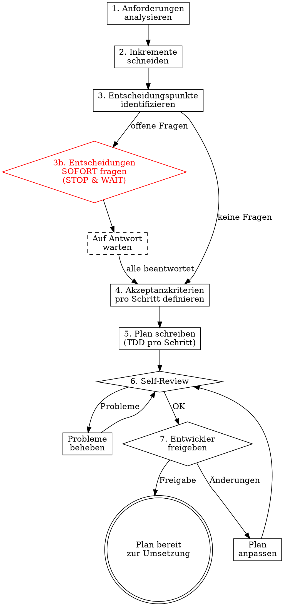

# Datacider Planning

## Overview

Create incremental, test-driven implementation plans where every step produces a verifiable result. The developer stays in control through explicit decision points, and acceptance criteria are auto-testable by the agent.

**Core principle:** Plan so that the developer can verify every step — through failing/passing tests, API calls, Storybook, or the UI. The agent prepares verification tooling as part of each step.

**Announce at start:** "Ich verwende datacider-planning um einen testgetriebenen, inkrementellen Plan zu erstellen."

## When to Use

- New features requiring multiple files/components
- Changes spanning backend + frontend
- Any task benefiting from incremental, verifiable delivery

## When NOT to Use

- Quick one-file fixes
- Pure config changes
- Tasks the developer explicitly wants to do ad-hoc

## The Planning Process



## Step 1: Anforderungen analysieren

Before planning, understand:
- Read the data model (`data-model.mmd`)
- Read CLAUDE.md for conventions
- Identify which layers are affected (DB, API, Hooks, Components, Pages)
- List all acceptance criteria from the user's request

**Ask the developer:**
> "Ich habe folgende Anforderungen verstanden: [Liste]. Fehlt etwas? Gibt es Prioritäten?"

## Step 2: Inkremente schneiden

Break the feature into increments. Each increment MUST:
- Produce a **verifiable result** the developer can check
- Be **independently testable** (not dependent on later increments to verify)
- Follow this order: **Schema → API → Hook → Component → Page Integration**

### Verifiability Matrix

| Layer | How to Verify | Agent Prepares |
|-------|--------------|----------------|
| **DB Schema** | Prisma migrate/push succeeds | Migration command |
| **API Route** | API-Integrationstests gegen SQLite DB + curl-Verifikation | Vitest-Testdatei mit echtem DB-Zugriff + curl-Befehle |
| **Custom Hook** | Unit test passes | Vitest test file |
| **Component** | Storybook story renders correctly + interaction test passes | Storybook story file with at least one `play` function testing user interaction |
| **Page Integration** | UI shows correct behavior | Playwright test or manual check description |
| **Business Logic** | Unit test passes | Vitest test file |
| **Dokumentation** | CLAUDE.md, data-model.mmd, API-Tabelle aktuell | Diff der Änderungen |

## Step 3: Entscheidungspunkte identifizieren und SOFORT klären

Identify decisions that affect the plan BEFORE writing it. These are:

- **Architecture decisions**: "Soll X als eigene Komponente oder in Y integriert werden?"
- **Data model changes**: "Ich würde das Schema so erweitern: [Schema]. Einverstanden?"
- **UX choices**: "Für die Darstellung sehe ich zwei Optionen: [A] oder [B]. Was bevorzugst du?"
- **API design**: "Der Endpunkt könnte [Option A] oder [Option B] sein. Was passt besser?"
- **Trade-offs**: "Einfacher mit X, flexibler mit Y. Was ist hier wichtiger?"

**CRITICAL RULE — Decision Points Block Planning:**
1. After analyzing requirements (Step 1-2), identify ALL open decision points
2. **Present them immediately as direct questions to the developer** — do NOT embed them in the plan text
3. **STOP and wait for the developer's answers** before writing ANY plan steps that depend on those decisions
4. Only after ALL decisions are resolved, write the complete plan (Steps 4-5)

**Format for presenting decision points:**

```
Bevor ich den Plan schreibe, brauche ich folgende Entscheidungen:

**Entscheidung 1: [Thema]**
[Kontext/Erklärung]
- **A:** [Option + Vor-/Nachteile]
- **B:** [Option + Vor-/Nachteile]

**Entscheidung 2: [Thema]**
...

Bitte entscheide, damit ich den Plan entsprechend schreiben kann.
```

**Rule:** When in doubt, ask. A 30-second question saves hours of rework. Never assume — never write plan steps based on unresolved decisions.

## Step 4: Akzeptanzkriterien pro Schritt

Every step gets acceptance criteria in one of these forms:

### Auto-testbar (Agent prüft selbst)

```markdown
**Akzeptanzkriterien:**
- [ ] `npx vitest run path/to/test.ts` → PASS
- [ ] `curl -X GET http://localhost:3000/api/endpoint` → `{ "expected": "response" }`
- [ ] `npx prisma db push` → keine Fehler
```

### Entwickler-testbar (Agent bereitet vor, Entwickler prüft)

```markdown
**Akzeptanzkriterien:**
- [ ] Storybook-Story unter `components/MyComponent.stories.tsx` zeigt korrektes Rendering
- [ ] Auf `/trainer` ist der neue Tab sichtbar und klickbar
- [ ] Nach Login als Trainer erscheint [erwartetes Verhalten]

**Zum Prüfen:** `npm run storybook` → http://localhost:6006 → [Story-Pfad]
```

## Step 5: Plan schreiben

### Plan-Header

```markdown
# [Feature Name] — Datacider Plan

**Ziel:** [Ein Satz]

**Inkremente:** [Anzahl] Schritte, jeder einzeln verifizierbar

**Entscheidungspunkte:** [Anzahl] Stellen, an denen der Entwickler gefragt wird

**Tech:** [Relevante Technologien]

---
```

### Schritt-Struktur

````markdown
## Schritt N: [Was dieses Inkrement liefert]

**Ergebnis:** [Was der Entwickler danach sehen/testen kann]

**Dateien:**
- Erstellen: `exact/path/to/file.ts`
- Ändern: `exact/path/to/existing.ts`
- Test: `exact/path/to/test.ts`

### N.1 Failing Test schreiben

```typescript
// exact/path/to/test.ts
import { describe, it, expect } from 'vitest';

describe('specificBehavior', () => {
  it('should do expected thing', () => {
    const result = myFunction(input);
    expect(result).toEqual(expected);
  });
});
```

### N.2 Test ausführen — FAIL erwarten

```bash
npx vitest run path/to/test.ts
```
Erwartet: FAIL — `myFunction is not defined`

### N.3 Minimal implementieren

```typescript
// exact/path/to/file.ts
export function myFunction(input: InputType): OutputType {
  return expected;
}
```

### N.4 Test ausführen — PASS erwarten

```bash
npx vitest run path/to/test.ts
```
Erwartet: PASS

### N.5 Commit

```bash
git add path/to/test.ts path/to/file.ts
git commit -m "feat: add specific feature"
```

**Akzeptanzkriterien:**
- [ ] `npx vitest run path/to/test.ts` → PASS
- [ ] [Weitere Kriterien je nach Layer]

````

**NOTE:** Decision points are resolved BEFORE writing the plan (Step 3b). The plan should reflect the developer's decisions, not contain open questions. If a new decision point emerges during execution, STOP immediately and ask the developer before continuing.

### Storybook-Schritte (für Komponenten)

Jede Frontend-Komponente MUSS mindestens eine Storybook-Story mit **Interaction Test** (`play` function) haben, die eine typische User-Interaktion abbildet.

````markdown
### N.6 Storybook-Story mit Interaction Test erstellen

```typescript
// exact/path/to/Component.stories.tsx
import type { Meta, StoryObj } from '@storybook/react';
import { expect, within, userEvent } from '@storybook/test';
import { Component } from './Component';

const meta: Meta<typeof Component> = {
  title: 'Category/Component',
  component: Component,
};
export default meta;

type Story = StoryObj<typeof Component>;

export const Default: Story = {
  args: { /* props */ },
  play: async ({ canvasElement }) => {
    const canvas = within(canvasElement);
    // Example: click a button and verify result
    await userEvent.click(canvas.getByRole('button', { name: /action/i }));
    await expect(canvas.getByText('expected result')).toBeInTheDocument();
  },
};
```

**Akzeptanzkriterien:**
- [ ] `npm run storybook` → Story rendert korrekt unter Category/Component
- [ ] Interaction Test (`play` function) läuft erfolgreich im Storybook Interactions Panel
````

### API-Verifikations-Schritte

````markdown
### N.7 API-Endpunkt verifizieren

```bash
# Dev-Server muss laufen: npm run dev
curl -X POST http://localhost:3000/api/endpoint \
  -H "Content-Type: application/json" \
  -H "Cookie: tt-session=<session-cookie>" \
  -d '{"key": "value"}'
```

Erwartete Antwort:
```json
{ "success": true, "data": { ... } }
```

**Akzeptanzkriterien:**
- [ ] HTTP 200 mit erwartetem Response-Body
- [ ] Daten in DB korrekt gespeichert (prüfen via Prisma Studio oder nächster GET-Request)
````

## Step 6: Self-Review

After writing the complete plan, review against this checklist:

| Prüfpunkt | Frage |
|-----------|-------|
| **Vollständigkeit** | Deckt der Plan alle Anforderungen ab? |
| **Inkrementell** | Liefert JEDER Schritt ein verifizierbares Ergebnis? |
| **TDD** | Hat JEDER Implementierungsschritt erst einen Test? |
| **Akzeptanzkriterien** | Hat JEDER Schritt konkrete, ausführbare Kriterien? |
| **Entscheidungspunkte** | Sind ALLE Architektur-/UX-/API-Entscheidungen markiert? |
| **Keine Platzhalter** | Kein "TBD", "TODO", "ähnlich wie Schritt X"? |
| **Reihenfolge** | Schema → API → Hook → Component → Page → Doku? |
| **Typen-Konsistenz** | Stimmen Typen/Funktionsnamen über alle Schritte? |
| **Konventionen** | Folgt der Plan den CLAUDE.md-Konventionen? |
| **Dokumentation** | Enthält der Plan einen Doku-Schritt? (CLAUDE.md, data-model.mmd, API-Tabelle) |

Fix issues found. Then proceed to user approval.

## Step 7: Entwickler-Freigabe — Grobe Übersicht zuerst

**CRITICAL RULE — Iterative Planpräsentation:**
1. Zuerst eine **kompakte Übersicht** aller Schritte präsentieren (Tabelle mit ~1-2 Sätzen pro Schritt, KEIN Code)
2. Den Entwickler fragen ob Reihenfolge, Umfang und Schritte passen
3. Erst nach Freigabe der Übersicht: **Schritt für Schritt** den detaillierten Plan durchgehen
4. Bei jedem Schritt fragen: "Soll ich das so machen?" — erst nach OK den nächsten Schritt detaillieren
5. Niemals den kompletten detaillierten Plan auf einmal zeigen

**Format für die Übersicht:**

```
## [Feature] — Übersicht

**Ziel:** [1-2 Sätze, was die Änderung bewirkt und warum]

**Gesamte Akzeptanzkriterien** (vom Entwickler nach Abschluss prüfbar):
- [ ] [Kriterium 1 aus Nutzersicht, z.B. "Alle Saisonspiele (VR + RR) werden im Mannschaftstab angezeigt"]
- [ ] [Kriterium 2, z.B. "Bestehende Sync-Funktion funktioniert weiterhin"]
- [ ] [Kriterium N]

| # | Schritt | Was passiert | Akzeptanzkriterien |
|---|---------|-------------|-------------------|
| 1 | **[Titel]** | [1-2 Sätze] | [Konkrete Prüfbefehle/Checks, z.B. `npx vitest run path/to/test.ts` → PASS] |
| 2 | **[Titel]** | [1-2 Sätze] | [Prüfbefehle/Checks] |
...

Passt Ziel, Akzeptanzkriterien, Reihenfolge und Umfang? Willst du etwas ändern?
```

Die **gesamten Akzeptanzkriterien** beschreiben das erwartete Endergebnis aus Nutzersicht — sie sind die Checkliste, anhand derer der Entwickler nach Abschluss aller Schritte prüft, ob das Feature vollständig und korrekt umgesetzt wurde. Die Akzeptanzkriterien pro Schritt in der Tabelle sind **kompakt** (1 Zeile, wichtigste Checks). Der detaillierte Plan enthält dann die vollständige Liste pro Schritt.

**Wait for explicit approval before proceeding.**

**Nach Freigabe der Übersicht:**
1. Grobplan als Datei speichern: `plan/YYYY-MM-DD-<feature-name>/grobplanung.md` (Übersicht mit Ziel, gesamten Akzeptanzkriterien, Schritt-Tabelle)
2. Erst danach beginnt die **Feinplanung**: Schritt für Schritt den detaillierten Plan durchgehen
3. Bei jedem Schritt fragen: "Soll ich das so machen?" — erst nach OK den nächsten Schritt detaillieren
4. Niemals den kompletten detaillierten Plan auf einmal zeigen
5. Jeder freigegebene Detail-Schritt wird in die Plan-Datei ergänzt

## Execution Rules

During plan execution:

1. **Stop at every decision point** — present options, wait for answer
2. **Run all acceptance criteria** after each step — report results
3. **If a criterion fails:** Stop, diagnose, ask developer if unclear
4. **After each step:** Brief status update ("Schritt N fertig. Alle Kriterien erfüllt. Weiter mit Schritt N+1?")
5. **Developer can always say:** "Zeig mir erstmal das Ergebnis" — then show/demo before continuing

## Pflichtschritt: Dokumentation aktualisieren

Jeder Plan MUSS als **vorletzten Schritt** (vor grafischer Validierung) einen Doku-Schritt enthalten:

1. **CLAUDE.md** — Neues Feature unter Keyfeatures dokumentieren, neue API-Endpunkte in die API-Tabelle eintragen
2. **data-model.mmd** — Bei Schema-Änderungen das Mermaid-Diagramm aktualisieren
3. **lib/types.ts** — Neue Interfaces sind bereits im Typen-Schritt erstellt, hier nur Vollständigkeit prüfen

**Akzeptanzkriterien für Doku-Schritt:**
- [ ] CLAUDE.md enthält Feature-Beschreibung unter Keyfeatures
- [ ] CLAUDE.md API-Tabelle enthält alle neuen Endpunkte
- [ ] data-model.mmd ist konsistent mit `prisma/schema.dev.prisma`

## Pflichtschritt: Grafische Validierung (letzter Schritt)

Jeder Plan MUSS als **letzten Schritt** eine grafische Validierung enthalten. Dabei wird die App im Browser gestartet und die gesamten Akzeptanzkriterien visuell geprüft.

**Dieser Schritt wird einmalig von einem Subagenten ausgeführt**, der Playwright nutzt um Screenshots zu machen und die UI-Ergebnisse zu verifizieren. Es ist **keine permanente Test-Suite**, sondern eine einmalige Abnahme.

### Ablauf

1. Dev-Server starten (falls nicht bereits laufend)
2. Relevante Seiten mit Playwright ansteuern
3. Screenshots der betroffenen UI-Bereiche erstellen
4. Screenshots gegen die gesamten Akzeptanzkriterien prüfen
5. Ergebnis an den Entwickler berichten (Screenshots + Pass/Fail pro Kriterium)

### Format im Plan

````markdown
## Schritt N (letzter): Grafische Validierung

**Ergebnis:** Einmalige visuelle Abnahme aller gesamten Akzeptanzkriterien durch Subagent

**Ausführung:** Subagent mit Playwright-Skill

**Zu prüfende Seiten:**
- `http://localhost:3000/[relevante-route]` — [was dort sichtbar sein soll]
- `http://localhost:3000/[weitere-route]` — [was dort sichtbar sein soll]

**Prüfschritte:**
1. [Seite aufrufen, ggf. Login/Navigation]
2. [Screenshot erstellen]
3. [Gegen Akzeptanzkriterium X prüfen: "Erwartung"]
4. [Weitere Prüfschritte]

**Akzeptanzkriterien:**
- [ ] Alle gesamten Akzeptanzkriterien aus der Übersicht visuell bestätigt
- [ ] Screenshots erstellt und dem Entwickler präsentiert
````

**WICHTIG:** Dieser Schritt ist eine **einmalige Validierung**, kein Playwright-Test der ins Repository committed wird. Der Subagent führt die Prüfung durch, berichtet das Ergebnis, und ist damit fertig.

## No Placeholders

Same as writing-plans: every step contains actual code, actual commands, actual expected output. Never write:
- "TBD", "TODO", "später ergänzen"
- "Ähnlich wie Schritt X" (wiederhole den Code)
- "Passende Fehlerbehandlung ergänzen"
- Steps without code blocks for code changes

## Plan Location

Pläne werden in einem Unterordner pro Feature abgelegt:

```
plan/YYYY-MM-DD-<feature-name>/
  grobplanung.md    # Übersicht mit Ziel, gesamten Akzeptanzkriterien, Schritt-Tabelle
  schritt-N.md      # Detail-Planung pro Schritt (wird nach Freigabe ergänzt)
```

(Follows project convention from CLAUDE.md)

## Integration

**Works with:**
- **superpowers:subagent-driven-development** — For executing steps via subagents
- **superpowers:executing-plans** — For inline execution
- **superpowers:finishing-a-development-branch** — After all steps complete
- **superpowers:verification-before-completion** — Final verification

## Common Mistakes

| Fehler | Lösung |
|--------|--------|
| Alle Schritte auf einmal ohne Verifikation | STOP — jeder Schritt wird einzeln verifiziert |
| Entscheidung selbst getroffen | STOP — bei Entscheidungspunkten immer fragen |
| Test nach Implementation geschrieben | STOP — TDD: Test IMMER zuerst |
| Großer Schritt ohne testbares Ergebnis | Aufteilen in kleinere, verifizierbare Inkremente |
| Storybook/API-Check vergessen | Jede UI-Komponente braucht eine Story, jeder Endpunkt einen curl-Test |
| Entscheidungspunkte im Plan eingebettet statt sofort gefragt | STOP — Entscheidungen VOR dem Plan klären, nicht als Teil des Plans |
