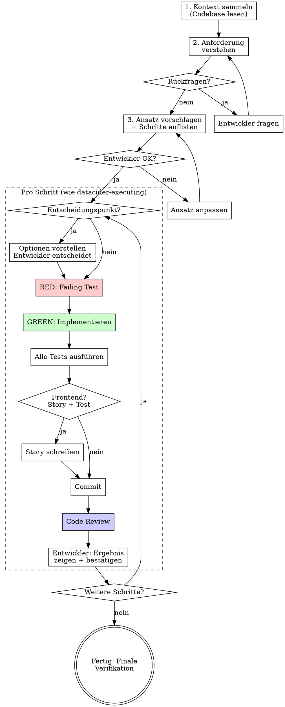

# DC Easy Feature Dev

## Overview

Implement features directly — no pre-existing plan needed. The agent gathers context from the codebase, proposes an approach, and executes with the same discipline as `datacider-executing`: TDD, code review after each task, developer decisions at every important point.

**Core principle:** Erst verstehen, dann vorschlagen, dann umsetzen — immer mit Entwickler-Kontrolle.

**Announce at start:** "Ich verwende dc-easy-feature-dev. Ich sammle zuerst den Kontext, dann schlage ich einen Ansatz vor."

## When to Use

- Small to medium features (1-5 Dateien betroffen)
- Bugfixes
- Erweiterungen bestehender Features
- Kein formaler datacider-planning Plan nötig

## When NOT to Use

- Große Features über viele Dateien → `datacider-planning` + `datacider-executing`
- Reine Konfigurationsänderungen → direkt machen

## The Process



## Phase 1: Kontext sammeln

Der Agent liest selbstständig:

1. **CLAUDE.md** — Projekt-Konventionen, Tech Stack
2. **data-model.mmd** — Datenmodell verstehen
3. **Betroffene Dateien** — Bestehenden Code lesen der relevant ist
4. **Bestehende Tests** — Testmuster und -konventionen erkennen
5. **Bestehende Stories** — Storybook-Konventionen erkennen (falls Frontend)

**Checkliste für Kontext-Sammlung:**

| Was | Wozu | Wo finden |
|-----|------|-----------|
| Datenmodell | Schema-Änderungen einschätzen | `data-model.mmd`, `prisma/schema.dev.prisma` |
| API-Routen | Bestehende Endpunkte verstehen | `app/api/` |
| Hooks | Bestehende Datenzugriffsmuster | `hooks/` |
| Komponenten | UI-Muster und Konventionen | `components/` |
| Types | Bestehende Interfaces | `lib/types.ts` |
| Tests | Test-Konventionen | `**/*.test.ts`, `**/*.stories.tsx` |

## Phase 2: Ansatz vorschlagen

Dem Entwickler präsentieren:

```
Ich habe den Kontext analysiert. Hier mein Vorschlag:

**Was zu tun ist:**
[Zusammenfassung der Änderungen]

**Betroffene Dateien:**
- [Datei 1] — [was sich ändert]
- [Datei 2] — [was sich ändert]

**Schritte:**
1. [Schritt 1 — was verifizierbar ist danach]
2. [Schritt 2 — was verifizierbar ist danach]
...

**Offene Fragen / Entscheidungen:**
- [Frage 1: Option A vs. Option B]

Einverstanden? Oder soll ich etwas anpassen?
```

**Warte auf Bestätigung bevor du anfängst.**

## Phase 3: Umsetzung — Pro Schritt

Identischer Workflow wie `datacider-executing`:

### Entscheidungspunkte

Bei Design-/Architektur-/UX-Entscheidungen:

```
Es gibt eine Entscheidung:

[Beschreibung]

Option A: [Beschreibung]
  + [Vorteil]  - [Nachteil]

Option B: [Beschreibung]
  + [Vorteil]  - [Nachteil]

Meine Empfehlung: [Option], weil [Grund].
Was möchtest du?
```

**Regel:** NIEMALS selbst entscheiden. Immer fragen.

### TDD — RED → GREEN

```bash
# RED: Failing Test zuerst
npx vitest run path/to/test.ts
# Erwartet: FAIL

# GREEN: Minimal implementieren
npx vitest run path/to/test.ts
# Erwartet: PASS
```

### Alle Tests ausführen

```bash
npx vitest run                    # Unit-Tests
npx vitest --project=storybook    # Storybook-Tests (bei Frontend)
npm run lint                      # Lint
```

### API Routes: Integrationstests gegen SQLite

Für jeden neuen/geänderten API-Endpunkt — Integrationstests schreiben, die gegen eine echte SQLite-Datenbank laufen (keine Mocks). Tests nutzen Prisma-Client direkt für Setup/Teardown und rufen die Route-Handler auf.

### Frontend: Storybook-Story + Test

Für jede neue/geänderte Komponente — Story erstellen, Storybook-Test ausführen. **Keine Playwright-Tests.**

### Commit + Review

Nach jedem logischen Schritt:
1. Commit mit beschreibender Message
2. Code Review (7-Punkte-Checkliste aus `datacider-executing`)
3. Bei Issues: beheben, Tests erneut, erneut reviewen

### Ergebnis zeigen

```
Schritt N abgeschlossen ✅

Ergebnis: [Was gebaut wurde]
Tests: ✅ [Anzahl] passed
Review: ✅ Keine Issues

Zum Selbst-Prüfen: [curl-Befehl / Storybook-URL / UI-Pfad]

Weiter? (Oder möchtest du erst prüfen?)
```

**Warte auf Bestätigung.**

## Red Flags — STOP

- Code vor Test geschrieben → Löschen, TDD neu starten
- Entscheidung selbst getroffen → Rückgängig, Entwickler fragen
- Tests nicht ausgeführt → Sofort nachholen
- Review übersprungen → Sofort nachholen
- Weitergemacht ohne Entwickler-OK → STOP, Ergebnis zeigen
- Playwright-Test geschrieben → Löschen, Storybook-Test stattdessen
- Kontext nicht gesammelt → STOP, erst lesen

## Pflichtschritt: Dokumentation aktualisieren

Vor dem Abschluss MUSS die Dokumentation aktualisiert werden:

1. **CLAUDE.md** — Neues Feature unter Keyfeatures dokumentieren, neue API-Endpunkte in die API-Tabelle eintragen
2. **data-model.mmd** — Bei Schema-Änderungen das Mermaid-Diagramm aktualisieren

**Akzeptanzkriterien:**
- [ ] CLAUDE.md enthält Feature-Beschreibung
- [ ] CLAUDE.md API-Tabelle enthält alle neuen Endpunkte
- [ ] data-model.mmd ist konsistent mit dem Prisma-Schema (falls Schema geändert)

## Abschluss

```
Feature abgeschlossen! 🏁

Zusammenfassung:
- [N] Schritte umgesetzt
- [Anzahl] Tests geschrieben, alle ✅
- [Anzahl] Storybook-Stories (falls Frontend)
- [Anzahl] Commits
- Dokumentation aktualisiert (CLAUDE.md, data-model.mmd)

Finale Verifikation:
npx vitest run → [Ergebnis]
npx vitest --project=storybook → [Ergebnis]
npm run lint → [Ergebnis]

Nächste Schritte?
```

## Common Mistakes

| Fehler | Lösung |
|--------|--------|
| Sofort losimplementieren ohne Kontext | Erst CLAUDE.md, Datenmodell, betroffene Dateien lesen |
| Keinen Ansatz vorschlagen | Immer erst Vorschlag + Bestätigung |
| "Kleines Feature, braucht keine TDD" | Jedes Feature bekommt TDD. Keine Ausnahmen. |
| Zu viele Schritte auf einmal | Pro Schritt: implementieren → testen → reviewen → zeigen |
| Kontext-Sammlung überspringen | Ohne Kontext falsche Annahmen → Nacharbeit |
